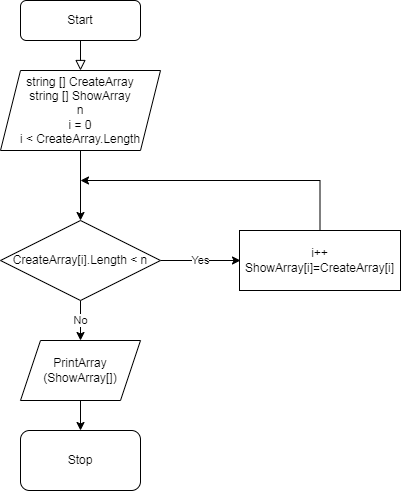

# Итоговая работа по окончании I четверти

## Итоговая проверочная работа

Для выполнение итоговой проверочной работы необходимо выполнить следующие задания: 

* создать репозиторий на GitHub;
* составить блок-схему алгоритма;
* создать файл-описание;
* написать программу, решающую данную задачу;
* использовать контроль версий.

## Алгоритм

Алгоритм решения задачи выглядит следующим образом:


### *Или же можно пройти по ссылке на гитхаб*

Это [мой репозиторий](https://github.com/selemenevpavel/controlwork1)

## Программа 

```C#
string[] CreateArray = new string[] {};
Console.WriteLine("Введите через пробел строки массива");
string Rows = Console.ReadLine();
CreateArray = Rows.Split(' ');

// Задаем первый массив из строк, которые вводятся с клавиатуры через пробел

string[] ShowArray = new string[CreateArray.Length];

// Задаем второй массив, который будем показывать на основе первого после работы метода

void SecondArray(string[] CreateArray, string[] ShowArray)
{
    Console.WriteLine("Введите максимальную длину строки для вывода");
    int n = Convert.ToInt32(Console.ReadLine());

    for (int i = 0; i < CreateArray.Length; i++)
    {
        if (CreateArray[i].Length <= n)
        {
            ShowArray[i] = CreateArray[i];
        }
    }
}

// Задали метод, который на основании первого массива создает второй при условии максимального количества символов не больше n

void PrintArray(string[] array)
{
    Console.Write("[");
    for (int i = 0; i < array.Length; i++)
    {
        Console.Write($"{array[i]}, ");
    }
    Console.WriteLine("]");
}

// Задали метод, который выводит в консоль полученный массив в квадратных скобках

SecondArray(CreateArray, ShowArray);
PrintArray(ShowArray);
```

## Идея решения
Решение задачи: 
1. введение с клавиатуры строк массива различной длины (знаком разделения строк массива является пробел);
2. введение с клавиатуры числа, определяющего максимальную длинну строки, которая появится на выходе;
3. на основании первого массива с учетом ограничения максимального количества символов в строке создается второй массив;
4. полученный массив выводится в консоль.


## Заключение
На этом, пожалуй, закончим
****